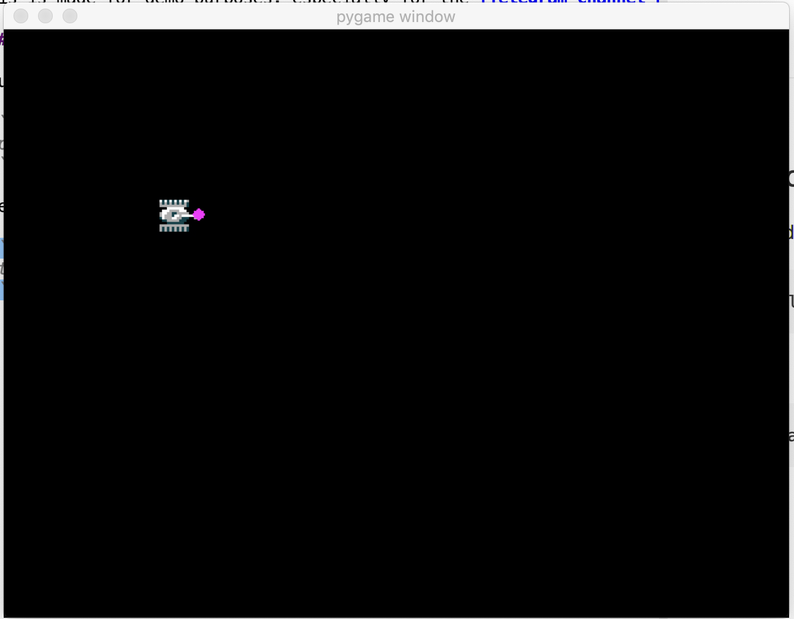

# Battle city port in Python

(Work in progress)

I try to remake the famous NES game Battle City (aka well-known Tanks for Dendy in Russia) with Python and PyGame library.
This is made for demo purposes, especially for the [Telegram Channel PyWay](https://t.me/pyway).

### How to run it?

You will need Python 3 and PyGame.

```
pip install -r requirements.txt
```

Then run:

```
python3 main.py
```

Screenshot:

